# Project Overview

This is a project in the database context proposed by the Faculty of Engineering of the University of Porto. A database was created, populated and queried according to the real world.

The project was designed from the UML to the creation of the database itself. The stages of the project were:
- UML
- Relational schema
- Functional Dependency Analysis
- Decomposition into 3rd Normal Form or Boyce-codd Normal Form
- Implementation of restrictions
- Creation and population of tables in SQLite
- 10 relevant queries and 3 relevant triggers

# Project Report
 If you want to see the complete project report click on the following button.



## UML

    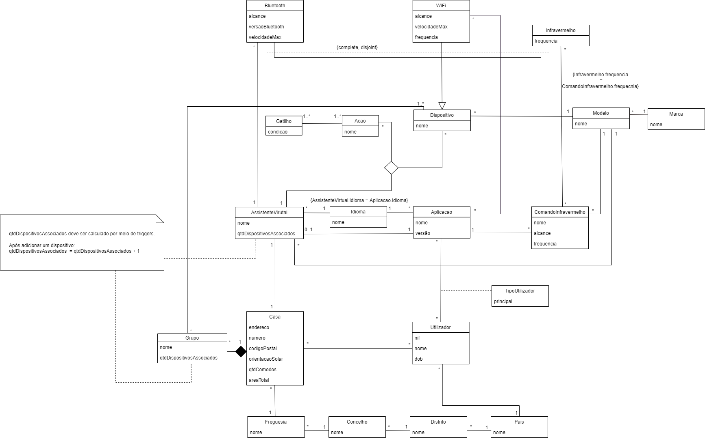

## Database Creation



## Database Population



## Query 1
What are the device model names that are either Apple branded or Microsoft or Amazon branded?

    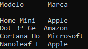

## Query 2
What is the most used language in virtual assistants that have a number of associated devices above the average rounded to 0 decimal places?

    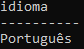

## Query 3
What are the 2 largest numbers of users, by nationality and by language of the applications they control? In the event of a tie, the tuple whose nationality is the lowest in alphabetical order must be selected.

    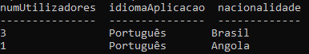

## Query 4
What is the name, model, range and maximum speed of bluetooth devices and wifi devices in the database, sorted in descending order of maximum speed?

    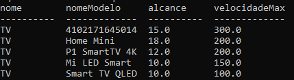

## Query 5
What is the model name of the infrared commands, whose application to which they are associated has a version greater than 2.3?

    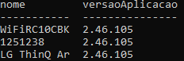

## Query 6
What is the name of the devices that belong to a group that contains 'house' in the name and whose solar orientation of the house to which they belong is East?

    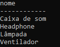

## Query 7
What is the difference between the maximum and minimum range of bluetooth devices that are connected to virtual assistants named 'Google Assistant'?

    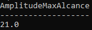

## Query 8
What are the conditions that allow triggering an action to turn infrared devices on or off via an Alexa virtual assistant?

    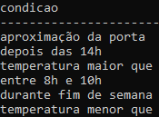

## Query 9
What is the sum of the different total areas of the houses and the number of houses that were counted, whose non-main users are over 20 years old and control applications in Portuguese?

    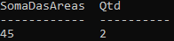

## Query 10
What are the names and models and brands of wifi devices that do not have an application associated with them in the database?

    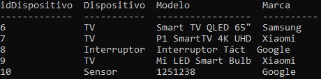



