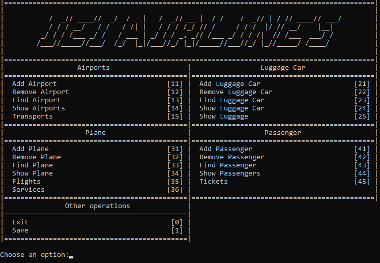
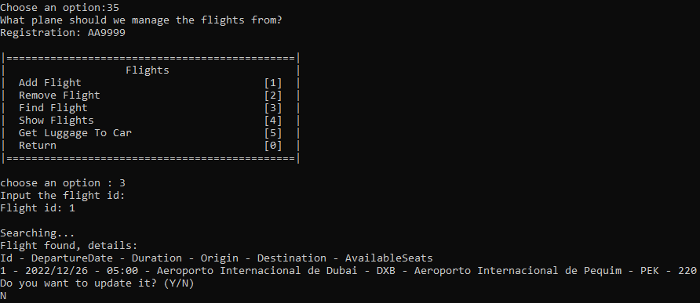

# **Airport System Project**

This project was developed in the context of learning algorithms and data structures. It consists of managing the resources of an airline.



## **Goal**

The objective was to implement the management of the airline using adequate abstract data structures, in addition to thinking about improving temporal and spatial complexity.

## **Abstract Data Structures Implemented**
- Stack
- Queue
- Doubly Linked List
- Vector
- Binary Search Tree (BST)

## **Project Overview**

A little sample of how to search for a flight in the management of the airline.

#### Input

    

#### Output

    

 



