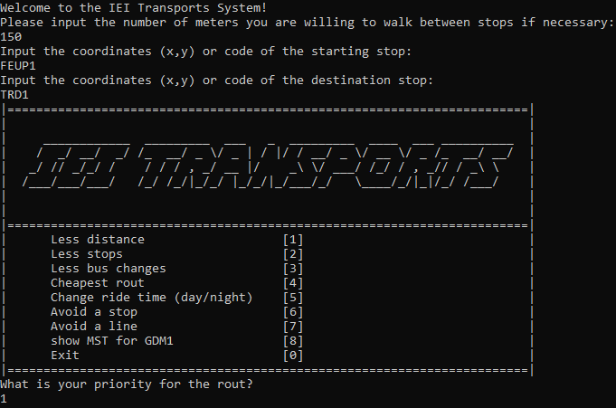
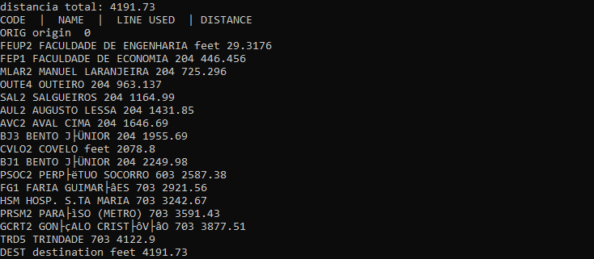

# Bus System Project

This project was developed in the context of learning algorithms and data structures. It consists of managing the bus system of Porto city.



## Goal

The objective was to implement an application that returns the best bus route to take to reach a destination in the city of Porto, starting from a specific point in the city. The graph structure was used, in addition to thinking about improving the temporal and spatial complexity.

## Algorithms Implemented
- DFS
- BFS
- Prim
- Dijkstra
- MST

## Project Overview

A little sample of how to find the shortest distance bus route from FEUP to Trindade.

### **Input**

    

### **Output**

    

 



---